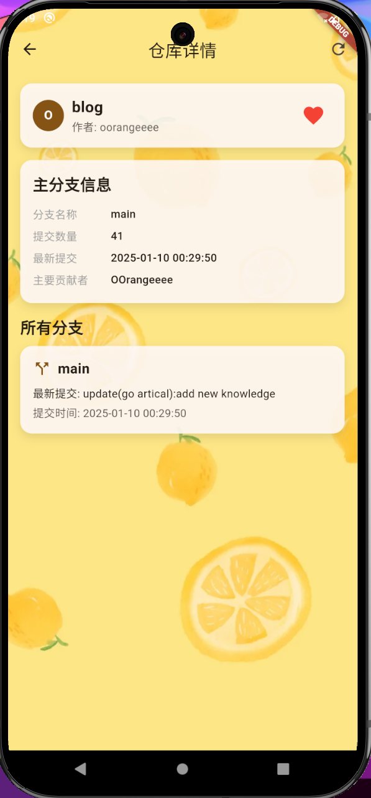

# GitHub Helper

## 介绍

这是一个可以随时查看任何一个公共的GitHub仓库信息的app。

由于用的是flutter编写的，所以可以轻松实现跨端。

因为国内正常很难直连GitHub，所以我写了一个后端，部署在我的服务器，把所有的要发给GitHub API来获取仓库信息的请求都整合到了一个请求中，并且进行了返回响应中数据的整合和清洗，最后拿到的信息如下：

* 仓库名称
* 仓库拥有者
* 仓库主分支信息
  * 主分支名称
  * 主分支提交数
  * 最后一次提交时间
  * 主要贡献者（commit最多的人）
* 所有分支的信息
  * 分支名称
  * 最新提交的信息
  * 最新提交的时间

## 技术栈

### 前端
- Flutter 框架
- Dart 编程语言

### 状态管理
- StatefulWidget 状态管理

### 网络请求
- http 包处理网络请求
- RESTful API 接口设计

### 数据存储
- 本地文件存储 (dart:io)
- JSON 数据序列化/反序列化
- 自定义缓存系统 (2小时有效期)

### 工具和依赖
- path_provider: 获取应用程序目录路径
- http: 网络请求处理

### 架构特点
- 模块化设计
- 工具类封装 (HttpHelper, StorageHelper, CacheHelper)
- 响应式UI设计
- 跨平台兼容

## 如何使用

### 通过源码编译使用

***注意直接clone的代码是不能用的，因为为了防止接口被攻击，我并没有上传url到github。毕竟两核两G的小鸡不能承受太多。。。***

但是你可以自己写一个简单的后端接口，将clone下的代码中所有"urlhere"替换为你的url，然后就可以用了。

对应接口的api文档如下：

#### API接口

GET /getRepoInfo

##### 请求参数

| 名称     | 位置  | 类型   | 必选 | 说明           |
| -------- | ----- | ------ | ---- | -------------- |
| repoName | query | string | 是   | 仓库名称       |
| owner    | query | string | 是   | 仓库拥有者名称 |

##### 返回数据结构

状态码 **200**

| 名称                           | 类型     | 必选 | 约束 | 说明                   |
| ------------------------------ | -------- | ---- | ---- | ---------------------- |
| » RepoInfo                     | object   | true | none | 仓库信息               |
| »» RepoName                    | string   | true | none | 仓库名称               |
| »» Owner                       | string   | true | none | 仓库拥有者             |
| »» MainBranch                  | object   | true | none | 主分支信息             |
| »»» MainBranchName             | string   | true | none | 主分支名称             |
| »»» MainBranchCommitNum        | integer  | true | none | 主分支提交数           |
| »»» MainBranchLatestCommitTime | string   | true | none | 主分支最后一次提交时间 |
| »»» MainContributor            | string   | true | none | 主分支主要贡献者       |
| »» Branches                    | [object] | true | none | 所有分支信息           |
| »»» BranchName                 | string   | true | none | 分支名称               |
| »»» LatestCommitMsg            | string   | true | none | 分支最新提交信息       |
| »»» LatestCommitTime           | string   | true | none | 分支最新提交时间       |

##### 返回结果示例

> 以著名的hello-algo为例

```json
{
  "RepoInfo": {
    "RepoName": "hello-algo",
    "Owner": "krahets",
    "MainBranch": {
      "MainBranchName": "main",
      "MainBranchCommitNum": 2047,
      "MainBranchLatestCommitTime": "2025-01-02 21:50:42",
      "MainContributor": "krahets"
    },
    "Branches": [
      {
        "BranchName": "main",
        "LatestCommitMsg": "Bug fixes and improvements (#1602)\n\n* Fix the search panel on mobile devices.\r\n\r\n* Fix the search panel for mobile devices.\r\n\r\n* Update about_the_book.md",
        "LatestCommitTime": "2025-01-02 21:50:42"
      },
      {
        "BranchName": "dev",
        "LatestCommitMsg": "Update Copyright 2024 to 2025.",
        "LatestCommitTime": "2025-01-02 23:04:51"
      },
      {
        "BranchName": "docker-dev",
        "LatestCommitMsg": "python c++ c",
        "LatestCommitTime": "2023-12-01 20:47:19"
      },
      {
        "BranchName": "docs",
        "LatestCommitMsg": "build",
        "LatestCommitTime": "2025-01-02 21:38:15"
      },
      {
        "BranchName": "gh-pages",
        "LatestCommitMsg": "deploy",
        "LatestCommitTime": "2025-01-02 21:38:22"
      }
    ]
  }
}
```

### 通过发布版本直接使用

发布版本已经存入releases中。

包含exe文件和apk文件。

## 开发/优化计划

- [X] 优化搜索页面
- [X] 优化主页面
- [X] 优化收藏页面
- [X] 优化错误页面
- [X] 加入缓存

ps：此项目因腾讯客户端菁英班而生，目前本人准备年后实习，时间有限，后续再来优化完善。

## 缓存特性说明

当第一次对于某个仓库进行搜索的时候，会从GitHub API获取数据，并保存到本地缓存。

缓存时限为2h，2h后会自动清除缓存。

在缓存时限内，再次搜索同一个仓库，会直接从本地缓存中获取数据，而不会再次请求API。

## 程序截图

主页面示例：


收藏页面示例：


搜索页面示例：



